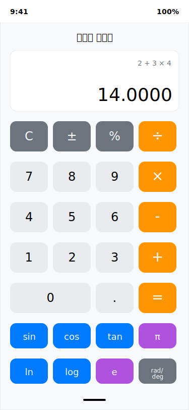
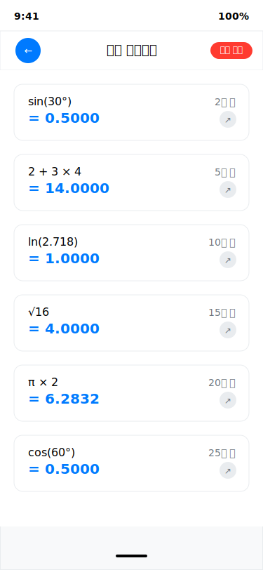
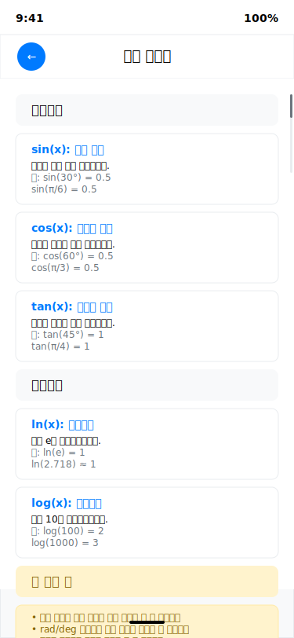

# 공학용 계산기 iOS 앱 와이어프레임

이 폴더에는 공학용 계산기 iOS 앱의 UI 와이어프레임이 SVG 형식으로 포함되어 있습니다.

## 와이어프레임 목록

### 1. 메인 계산기 화면

#### 세로 모드 (Portrait Mode)

-   **파일**: `portrait_mode.svg`
-   **화면 크기**: 375 × 812 (iPhone 13/14 기준)

-   **주요 구성 요소**:
    -   상단 상태바 (시간, 배터리)
    -   디스플레이 영역 (수식 및 결과 표시)
    -   기능 버튼 행 (C, ±, %, ÷)
    -   숫자 및 연산자 버튼 (0-9, +, -, ×, ÷, =)
    -   공학 함수 버튼 (sin, cos, tan, ln, log, π, e)
    -   각도 단위 전환 버튼 (rad/deg)

#### 확장 기능 접근

세로 모드에서도 모든 고급 공학 함수에 접근할 수 있도록 다음과 같은 방식으로 구성:

-   **기본 공학 함수**: sin, cos, tan, ln, log, π, e
-   **확장 함수 접근**:
    -   버튼 길게 누르기로 컨텍스트 메뉴 표시
    -   역삼각함수 (asin, acos, atan)
    -   추가 수학 함수 (x², √x, xʸ, !, 1/x)
    -   지수 함수 (eˣ, 10ˣ, log₂)
-   **유틸리티 버튼**: hist, help, 각도 단위 전환

### 2. 히스토리 화면

-   **파일**: `history_screen.svg`

-   **기능**:
    -   최근 10개 계산 결과 표시
    -   각 항목별 계산식과 결과 표시
    -   계산 시간 표시 (상대적 시간)
    -   결과 재사용 버튼
    -   전체 삭제 기능

### 3. 도움말 화면

-   **파일**: `help_screen.svg`

-   **기능**:
    -   함수별 상세 설명
    -   사용 예시 제공
    -   사용 팁 안내
    -   스크롤 가능한 콘텐츠

## 디자인 시스템

### 색상 팔레트

-   **숫자 버튼**: `#e9ecef` (밝은 회색)
-   **연산자 버튼**: `#ff9500` (오렌지)
-   **공학 함수 버튼**: `#007aff` (파란색)
-   **상수 버튼**: `#af52de` (보라색)
-   **특수 기능 버튼**: `#6c757d` (진한 회색)
-   **배경색**: `#f8f9fa` (연한 회색)
-   **텍스트 색상**: `#000000` (검정), `#6c757d` (회색)

### 타이포그래피

-   **제목**: SF Pro Display, 18pt, Bold
-   **버튼 텍스트**: SF Pro Display, 14-24pt, Regular/Medium
-   **수식/결과**: SF Mono, 12-36pt, Light/Regular
-   **설명 텍스트**: SF Pro Display, 12pt, Regular

### 버튼 스타일

-   **모양**: Rounded Rectangle (12px radius)
-   **크기**:
    -   세로 모드: 75×60px (숫자), 75×50px (함수)
    -   가로 모드: 55×45px (일반), 120×45px (0 버튼)
-   **간격**: 8px

### 레이아웃 원칙

-   **여백**: 20px (좌우), 8px (버튼 간)
-   **디스플레이 영역**: 화면 높이의 약 25%
-   **버튼 영역**: 화면 높이의 약 75%
-   **안전 영역**: iOS Safe Area 준수

## 사용자 경험 (UX) 고려사항

### 접근성

-   **터치 타겟**: 최소 44×44pt (Apple HIG 준수)
-   **색상 대비**: WCAG 2.1 AA 기준 준수
-   **텍스트 크기**: 동적 타입 지원 고려

### 상호작용

-   **버튼 피드백**: 터치 시 시각적 피드백
-   **애니메이션**: 부드러운 전환 효과
-   **제스처**: 스와이프로 히스토리 접근

### 정보 계층

-   **우선순위**: 결과 > 수식 > 버튼
-   **시각적 구분**: 색상과 크기로 기능별 구분
-   **일관성**: 전체 화면에서 일관된 디자인 패턴

## 구현 참고사항

### SwiftUI 구현 시 고려사항

-   **LazyVGrid**: 버튼 레이아웃에 사용
-   **GeometryReader**: 동적 크기 조정
-   **@State**: 화면 상태 관리
-   **Sheet**: 모달 화면 (히스토리, 도움말)

### 반응형 디자인

-   **기기별 대응**: iPhone 13 mini ~ iPhone 14 Pro Max
-   **화면 방향**: 세로 모드 전용 (Portrait Only)
-   **최적화**: 학습 환경에 최적화된 단일 방향 인터페이스
-   **다크 모드**: 향후 버전에서 지원 예정

## 버전 히스토리

-   **v1.0**: 초기 와이어프레임 생성 (2024)
-   기본 계산기 기능 중심의 UI 설계
-   공학 함수 및 히스토리 기능 포함
